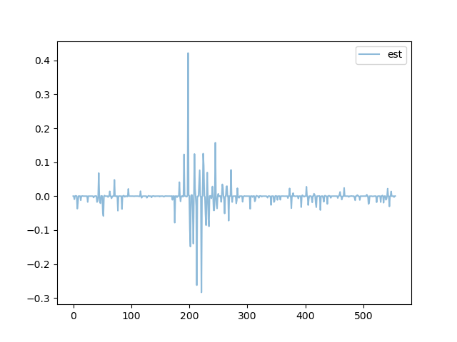
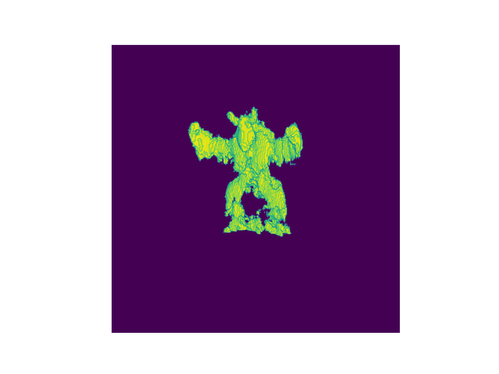
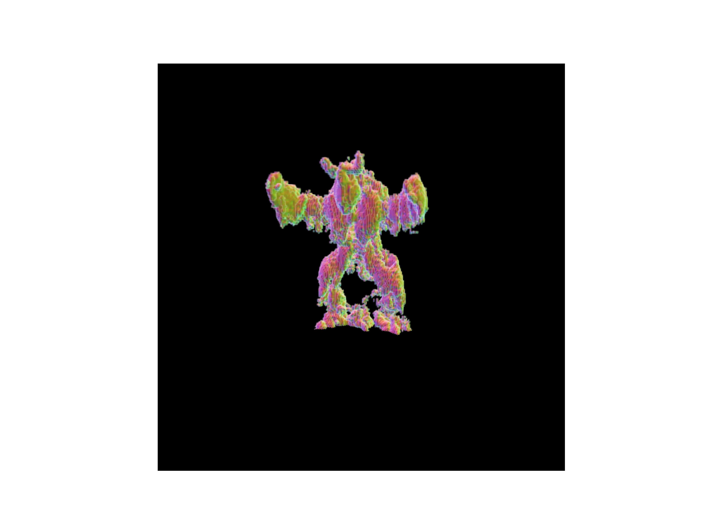
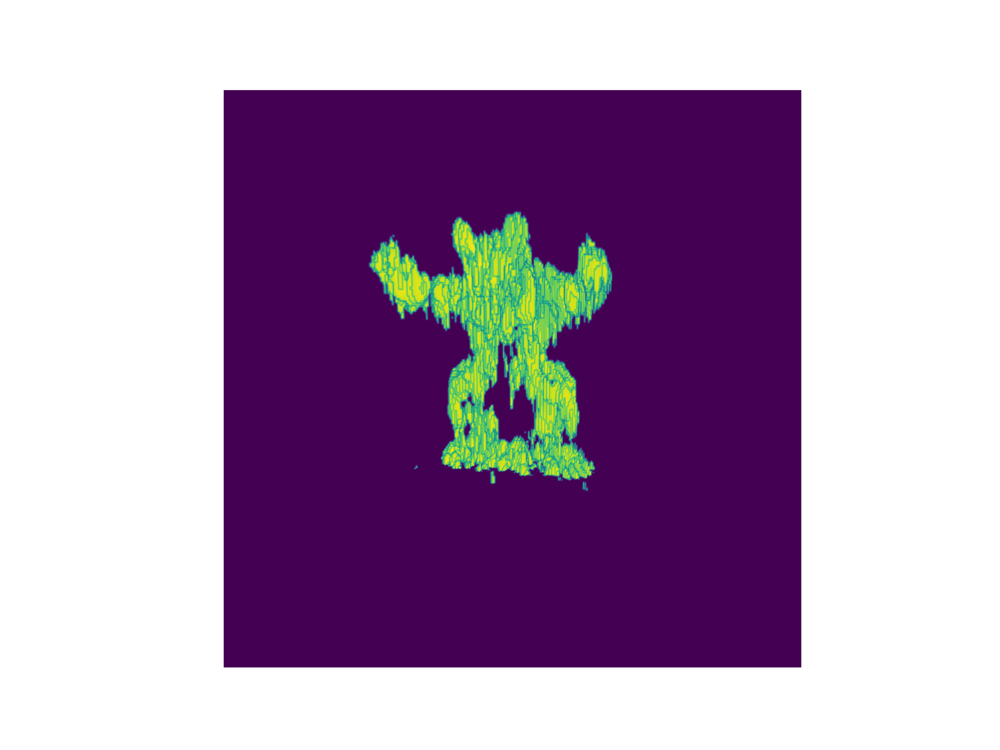
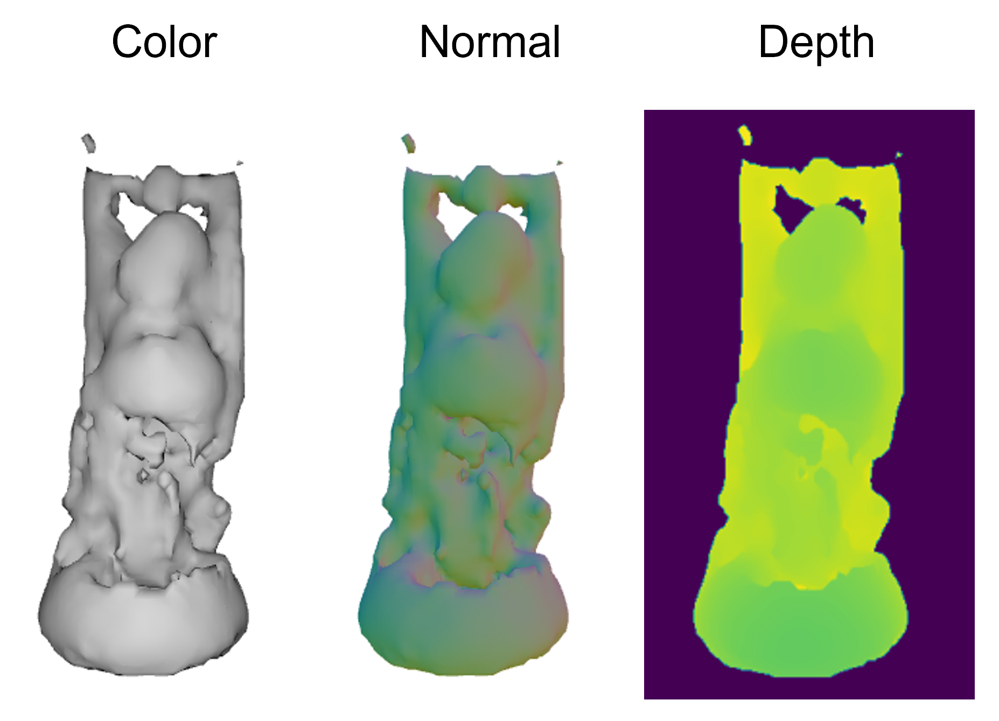
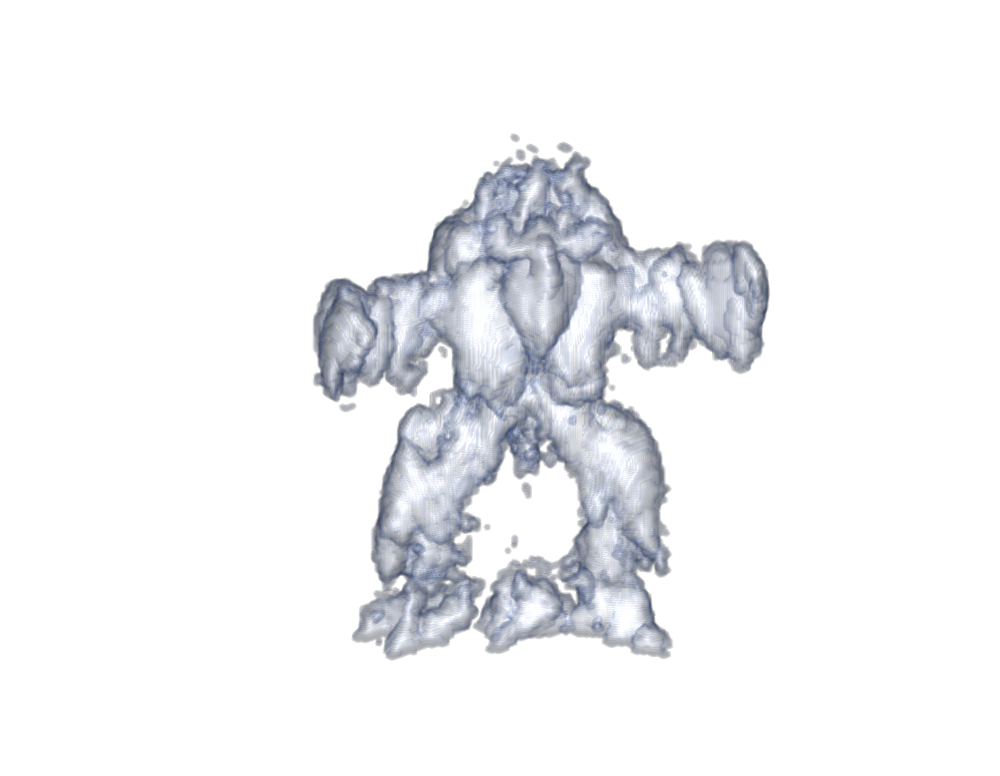

# Neural Volumetric Reconstructions for Coherent Synthetic Aperture Sonar

`<anonymous authors>`

## Dependencies
This code requires the tiny-cuda-nn python bindings which need to be compiled. You can get the code here:
https://github.com/NVlabs/tiny-cuda-nn. Make sure you can run the 
`tiny-cuda-nn/samples/mlp_learning_an_image_pytorch.py` example. 

You can install all other dependencies with `pip install -r requirements.txt`.

The code uses tensorboard for tracking reconstructions. You can start the tensorboard session by running `run_tensorboard.sh`.
You will need to populate the script with your details: 
`tensorboard --logdir ./ --host <host-number> --port <port-number>`. You can find your `<host-number>` with the `hostname -I` command on Ubuntu.

We will make the code runnable without tensorboard when we release it to github.

## AirSAS Reconstructions
We have included the data to reconstruct the bunny and armadillo measured with the 20 kHz and 5 kHz LFMs.

You will need to download the data from this anonymous google drive link:

https://drive.google.com/file/d/18yMVWS3ZxEgillaqs6aQXBnhgDcRD19c/view?usp=share_link

Note that this link is defined using has no information that breaks anonymity. 

This link will download a `.zip` file. Unzip the file
to obtain:

`system_data_bunny_20k.pik`
`system_data_bunny_5k.pik`
`system_data_arma_20k.pik`
`system_data_arma_5k.pik`

These pickle files contain the data necessary to reconstruct the AirSAS scenes of the bunny and armadillo measured with
an LFM waveform at 20 kHz and 5 kHz bandwidths. 

For those interested: These .pik files contain a dictionary structure
that adheres to the structure of the `SASDataSchema` cass in `data_schemas.py`. This file contains explanatory
comments next to the fields of each class. Feel free to skip this if you wish to simply run the code. 

Will provide an example for reconstructing the 20 kHz armadillo. The other reconstructions
will be identical steps:

1) Navigate to `./scenes/airsas/arma_20k`
You can validate the correctness of running the next steps by comparing to our output in `./scenes/airsas/arma_20k/example_outputs` of the following steps

### Proposed method reconstruction
Our method is two steps: (1) pulse deconvolution and (2) neural backprojection.

1) `chmod +x pulse_deconvolve.sh` to make the pulse deconvolution script executable. You will need to edit line 5 of `pulse_deconvolve.sh` with the path to the system_data pickle file: `--system_data <path/to/this/file/system_data_arma_20k.pik> \`
2) `./pulse_deconvolve.sh` to deconvolve measurements within the `./scenes/airsas/arma_20k/system_data.pik` object.
    - While running, you should see output like:
    `etc... Batch 18 / 150 Epoch 999 Loss 0.0005951461992628921 Sparsity 0.0007920265197753906 Phase 4.170963306255696e-05 TV 0.0
Saving Weights.. etc...`
3) Make sure that Step 3 outputted deconvolved measurements to the directory `./scenes/airsas/arma_20k/deconvolved_measurements/numpy`. The directory should contain `.npy` files that say `weights*_*.npy`. You can find visualizations of deconvolved measurements in `./scenes/airsas/arma_20k/deconvolved_measurements/images`, for example:
 shows the real-valued deconvolved waveform of the first sensor measurement. Note the title of the rightside plot in `comparison*.png` should say `raw measurements` rather than matched filtered (MF).
4) Reconstruct the scene from the deconvolved measurements using `neural_backproject.sh`. You will need to edit line 6 of `neural_backproject.sh` with the path to the system_data pickle file: `--system_data <path/to/this/file/system_data_arma_20k.pik> \`. Notice that the `./deconvolved_measurements` directory is passed in as one of the arguments. Note that you can track this programs progress on tensorboard.
5) The `neural_backproject.sh` script will periodically output images, `.npy` files of the scene and normals, and the model as `.tar` files to `./npb_output`.
6) You can render the scene using `render_nbp_output.sh.sh` and scene normals using `render_nbp_output_normals.sh`.
7) You can find the example outputs of the renders in `./example_outputs/renders/arma_20k_release_iter_*.png`
Here is the reconstructed scatterer magnitude:

Here are the reconstructed normals (weighted by scatterer magnitude)

While we have populated the `*.sh` files with the settings used to generate the paper results, please note that these results may vary slightly from the paper due to randomness in the optimizations. Also note that, in the paper, we render real results using matlab's volshow() function. 
Our only preprocessing step is a linear threshold where `scatteres[scatterers < thresh] = 0`. We use the same threshold for backprojection and Neural backprojection results shown in this readme. The threshold value can be tuned
using the `--thresh` input argument (should be a float type between `[0-1]`)  to the `render*.sh` scripts.

### Backprojection

In the paper, we compare our method to backprojection extensively. 

1) The backprojection for each method is obtained by running `backproject.sh`. You will need to edit line 4 of `backproject.sh` with the path to the system_data pickle file: `--orig_system_file <path/to/this/file/system_data_arma_20k.pik> \`.
2) You can render the backprojected scene using `render_bp.sh`
3) You can find the example outputs of the render in `./example_outputs/renders/bp.png`
Here is the backprojected image:

### Gradient Descent Baseline
We also compare to a gradient descent baseline in the paper, which is our method without a neural network. 
The gradient descent baseline can be run simply by adding the `--no_network` flag to the `neural_backproject.sh` script.
Gradients are backpropagated directly to image voxels rather than the weights of a network.

## SVSS Reconstructions
Please contact `name available upon paper acceptance` for the SVSS dataset and processing scripts. 

## Simulated Reconstructions
Download the folder containing the transient measurements and system_data.pik file from here:

https://drive.google.com/drive/folders/1bWUpcjJhro5m035W98DHDBYv13PGidRF?usp=share_link

The folder contains a `system_data.pik` file. Download this file as it will be needed for running the 
simulation data.

The link points to 8 simulated scenes: bunny, xyz_dragon, lucy, dragon, buddha, and aramdillo.
In particular, each folder contains rendered transients from the scene using our ToF renderer. We will
convolve these transients with the sonar waveform to simulate measurements.

Additionally, the folder contains a `gt_meshes` folder used for evaluation. 

We provide an example for reconstructing the buddha object in `scenes/simulated/buddha`. To run this scene:

1) Download the `buddha/data_full.npy` file from the link above.
2) We first will simulate sonar waveforms using the scripts within `scenes/simulated/buddha`. In `simulate_waveforms.sh`, point `--input_config` to the path of the `system_data.pik` file downloaded from the google drive link. This pickle file contains the scene configuration and is used for all simulated scenes. Additionally, point the `--wfm_part_1` argument to the transients file `buddha/data_full.npy`. This script will create a new system_data pickle file that will contain the simulated measurements. Define this new file using the `--output_config` argument (currently it is set to `system_data_20db.pik`).
3) Use `chmod +x simulated_waveforms.sh` to make the script executable, and then run with `./simulated_waveforms.sh`. The simulated measurements will be generated into the new system data pickle file defined by `--output_config`.
4) Next we deconvolve the measurements using the `pulse_deconvolve.sh` script. Pass in the new system data pickle file containing the simulated measurements to `--system_data`. Deconvolved measurements will be written to the `--output_dir`.
5) Now we reconstruct the scene from deconvolved measurements using `neural_backproject.sh`. Once again, pass in the new system data pickle file containing the simulated measurements to `--system_data`. All other parameters are set to those used for the paper result. Results and reconstructions will be sent to `--output_dir`

We will point to the code for simulating measurements upon paper acceptance.

### Metric Evaluation and Mesh Visualization
For metric evaluation, you have to run main files in `evaluate` folder.
1) First, generate ground truth point cloud on surface or volume by running `main_generate_gt_point_cloud.sh`.
2) Run `main_mesh_recon_and_3d_space_loss.sh`. This will reconstruct 3d mesh from learned model and also calculate following 3d space loss from given point cloud.
Here, point cloud is generated in two ways, directly from INR voxels (comp_albedo), or from reconstructed 3D mesh. 

- Surface Chamfer Distance : Chamfer distance based on surface point cloud.
- Volume Chamfer Distance : Chamfer distance based on volume point cloud.
- IoU : Intersection over union using between two voxels built from point cloud.

3) Then, run `main_render.sh` to render reconstructed mesh. This will render radiance and depth image using reconstructed mesh, at different camera azimuths.
4) Finally run `main_image_space_loss.sh` to calculate image space loss (lpips, psnr, mse...) on color image or depth image.

Example configurations are provided in `.sh` files, but please make sure to set it corresponding to your enviroment.

Here is the example rendered mesh of reconstructed buddha using our method:

We also attach the example of each matric in `example_metrics` folder.
<!-- In the main paper, we use IoU from INR voxels and surface Chamfer distance from reconstructed 3D mesh in the main paper. -->

<!-- Example configurations are provided in `predefined_configs.py`, but some arguments are not given, so please set the correct file inputs depends on your experiment setting. -->
<!-- We also provide example configurations as `.sh` files, so please check it. -->

## Reconstructing Using Your Own Data

Running your own data requires creating a dictionary object that adheres to the schema defined by 
`SASDataSchema` class shown in `data_schemas.py`. Then, you can use `pulse_deconvolve.sh` and `neural_backproject.sh`
scripts to deconvolve and reconstruct measurements. More details will be available upon paper acceptance.

To generate your own transient signal from rendering, please refer [here](https://github.com/juhyeonkim95/MitsubaPyOptiXTransient).

## Visualizations

AirSAS results in the paper were rendered with matlab. The `matlab/` directory contains helper scripts. Use `convert_npy_to_mat.py` to convert a `*.npy` file to `*.mat` file. Pass this mat file to the `generate_figures_tiles.m` to render. Line 57-58 contain the view angle. We use theta_vector=230 for armadillo renderings, and theta_vector=180 for bunny renderings. The color can be changed using the `Colormap=` argument on line 38. We use `colormap_blue` for the armadillo and `colormap_red` for the bunny.
Here is the reconstructed armadillo rendered with matlab:

The python file `inr_reconstruction/upsample_network.py` loads a model file, experiment directory and can be used to upsample the 
scene using the scale factor `sf` parameter on line 72. `sf=2` was used to generate paper results. 