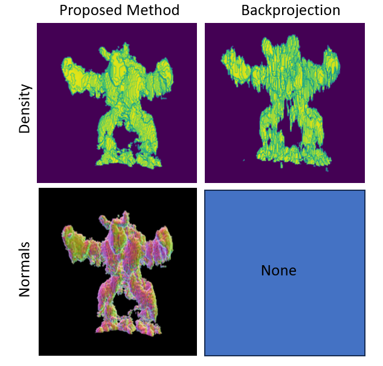

# Neural Volumetric Reconstructions for Coherent Synthetic Aperture Sonar

Codebase for [Neural Volumetric Reconstructions for Coherent Synthetic Aperture Sonar](https://arxiv.org/abs/2306.09909) 
by Albert W. Reed, Juhyeon Kim, Thomas Blanford, Adithya Pediredla, Daniel C. Brown, and Suren Jayasuriya.

  

## Dependencies
This code requires the tiny-cuda-nn python bindings. You will need to 
[download and compile from here](https://github.com/NVlabs/tiny-cuda-nn). Make sure the 
`tiny-cuda-nn/samples/mlp_learning_an_image_pytorch.py` runs without errors. 

You can install python dependencies with `pip install -r requirements.txt`.

The code uses tensorboard for saving models and reconstructions. Start a tensorboard session by running 
`run_tensorboard.sh`.  You may populate the script with your details: 
`tensorboard --logdir ./ --host <host-number> --port <port-number>`. Note that you may find `<host-number>` using the 
`hostname -I` command on Ubuntu.

## AirSAS Reconstructions
[This repo stores a .zip file](https://drive.google.com/file/d/18yMVWS3ZxEgillaqs6aQXBnhgDcRD19c/view?usp=share_link) 
containing AirSAS measurements of the bunny and armadillo using the 20 kHz and 5 kHz linearly frequency modulated 
(LFM) waveforms.

Unzip the file to obtain: (1) `system_data_bunny_20k.pik`; (2) `system_data_bunny_5k.pik`; (3)`system_data_arma_20k.pik`;
(4) `system_data_arma_5k.pik`

The pickle file names indicate the scene (i.e., bunny or armadillo) and which LFM was used (i.e., 5k or 20k). Each
pickle file contains measurements and metadata necessary for scene reconstruction. In particular, each contains a 
dictionary defined by the `SASDataSchema` class in `data_schemas.py`. 

We will provide the reconstruction steps using the 20 kHz armadillo as an example. We will provide steps for our
method and backprojection. 

1) Navigate to the `./scenes/airsas/arma_20k` directory. Note that we provide example outputs (like shown in the image below) 
of the next steps in `./scenes/airsas/arma_20k/example_outputs` to validate against.

  

### Proposed method reconstruction
Our method consists of (1) pulse deconvolution and (2) neural backprojection. Pulse deconvolution compresses the sonar
measurements via a deconvolution optimization, and neural backprojection uses deconvolved measurements
(and scene geometry metadata) to reconstruct the scene. 

1) Use `chmod +x pulse_deconvolve.sh` to make the pulse deconvolution script executable. You will need to edit the `--system_data` argument (line 5 of `pulse_deconvolve.sh`) 
with the path to the system_data pickle file for the 20k armadillo (i.e., `--system_data <path/to/this/file/system_data_arma_20k.pik> \`).
2) Execute the `./pulse_deconvolve.sh` script to deconvolve measurements contained in `./scenes/airsas/arma_20k/system_data.pik`.
    - While running, you should see output like:
    `etc... Batch 18 / 150 Epoch 999 Loss 0.0005951461992628921 Sparsity 0.0007920265197753906 Phase 4.170963306255696e-05 TV 0.0
Saving Weights.. etc...`
3) Ensure the previous step placed deconvolved measurements in the directory `./scenes/airsas/arma_20k/deconvolved_measurements/numpy`. 
4) The directory should contain `.npy` files named `weights*_*.npy`. You can find visualizations of deconvolved measurements in 
`./scenes/airsas/arma_20k/deconvolved_measurements/images`, for example: `./scenes/airsas/arma_20k/deconvolved_measurements/images/weights0_999.png` 
shows the real-valued deconvolved waveform of the first sensor measurement. Note the `MF` title in
`comparison*.png` is incorrect --- it should read `raw measurements` instead.
4) Reconstruct the scene from the deconvolved measurements using `neural_backproject.sh`. Edit line 6 of `neural_backproject.sh` 
with the path to the system_data pickle file: `--system_data <path/to/this/file/system_data_arma_20k.pik> \`. Note that the 
`./deconvolved_measurements` directory is passed in as one of the arguments to pass deconvolved measurements to neural backprojection. 
Note that you can track this programs progress on tensorboard.
5) The `neural_backproject.sh` script will periodically output images, `.npy` files of the scene and normals, 
and the model as `.tar` files to `./npb_output`.
6) Render `*.npy` files using `render_nbp_output.sh.sh` and scene normals using `render_nbp_output_normals.sh`. 
These scripts use PyQTGraph to render.
7) See the visualizations section at the bottom of this README for instructions on rendering with Matlab as done in the paper.

Find the example outputs of the renders in `./example_outputs/renders/arma_20k_release_iter_*.png`.

### Backprojection

In the paper, we compare our method to backprojection extensively. 

1) Backproject the scene using `backproject.sh`. Similarily to the neural backprojection step, it is necessary to 
edit line 4 of `backproject.sh` with the path to the system_data pickle 
file: `--orig_system_file <path/to/this/file/system_data_arma_20k.pik> \`.
2) Render the backprojected scene using `render_bp.sh`

Find the example outputs of the render in `./example_outputs/renders/bp.png`

### Gradient Descent Baseline
We also compare to a gradient descent baseline in the paper, which is our method without a neural network. 
The gradient descent baseline can be run simply by adding the `--no_network` flag to the `neural_backproject.sh` script.
Gradients are backpropagated directly to image voxels rather than the weights of a network.

## SVSS Reconstructions
In accordance with funding agency guidelines, please contact `Daniel C. Brown at dcb19@psu.edu` to request access to the 
SVSS dataset and processing scripts. 

## Simulated Reconstructions
[Download the folder containing transient measurements and system_data.pik file](https://drive.google.com/drive/folders/1bWUpcjJhro5m035W98DHDBYv13PGidRF?usp=share_link)

The folder contains a `system_data.pik` file. Download this file as it will be needed for running the 
simulation data.

The link points to 8 simulated scenes: bunny, xyz_dragon, lucy, dragon, buddha, and aramdillo.
In particular, each folder contains rendered transients from the scene using our ToF renderer. We will
convolve these transients with the sonar waveform to simulate measurements.

Additionally, the folder contains a `gt_meshes` folder used for evaluation. 

We provide an example for reconstructing the buddha object in `scenes/simulated/buddha`. To run this scene:

1) Download the `buddha/data_full.npy` file from the link above.
2) We first will simulate sonar waveforms using the scripts within `scenes/simulated/buddha`. 
In `simulate_waveforms.sh`, point `--input_config` to the path of the `system_data.pik` file downloaded from the 
google drive link. This pickle file contains the scene configuration and is used for all simulated scenes. Additionally, 
point the `--wfm_part_1` argument to the transients file `buddha/data_full.npy`. This script will create a new system_data 
pickle file that will contain the simulated measurements. Define this new file using the `--output_config` argument 
(currently it is set to `system_data_20db.pik`).
3) Use `chmod +x simulated_waveforms.sh` to make the script executable, and then run with `./simulated_waveforms.sh`. 
The simulated measurements will be generated into the new system data pickle file defined by `--output_config`.
4) Next we deconvolve the measurements using the `pulse_deconvolve.sh` script. Pass in the new system data pickle file 
containing the simulated measurements to `--system_data`. Deconvolved measurements will be written to the `--output_dir`.
5) Now we reconstruct the scene from deconvolved measurements using `neural_backproject.sh`. Once again, pass in the new 
system data pickle file containing the simulated measurements to `--system_data`. All other parameters are set to those 
used for the paper result. Results and reconstructions will be sent to `--output_dir`

### Metric Evaluation and Mesh Visualization
We provide code for computing metrics of simulated reconstructions in the `evaluate` folder.
1) First, generate the ground truth point cloud on surface or volume by running `main_generate_gt_point_cloud.sh`.
2) Run `main_mesh_recon_and_3d_space_loss.sh`. This will reconstruct 3d mesh from learned model and also calculate 
following 3d space loss from given point cloud.

Here, the point cloud is generated in two ways, directly from INR voxels (comp_albedo), or from reconstructed 3D mesh. 

- Surface Chamfer Distance : Chamfer distance based on surface point cloud.
- Volume Chamfer Distance : Chamfer distance based on volume point cloud.
- IoU : Intersection over union using between two voxels built from point cloud.

3) Then, run `main_render.sh` to render reconstructed mesh. This will render color, normal and depth image using 
reconstructed mesh, at different camera azimuths.
4) Finally run `main_image_space_loss.sh` to calculate image space loss (lpips, psnr, mse...) on color image or depth image.

Example configurations are provided in `.sh` files, but please make sure to set it corresponding to your environment.

Find an example of the rendered mesh of reconstructed buddha using our method in `./evaluate/example_images/buddha_rendered_images_v1.0.png`.

  

We also attach the example of each matric in `example_metrics` folder.
<!-- In the main paper, we use IoU from INR voxels and surface Chamfer distance from reconstructed 3D mesh in the main paper. -->

<!-- Example configurations are provided in `predefined_configs.py`, but some arguments are not given, so please set the correct file inputs depends on your experiment setting. -->
<!-- We also provide example configurations as `.sh` files, so please check it. -->

## Reconstructing Using Your Own Data

Running your own data requires creating a dictionary object that adheres to the schema defined by 
`SASDataSchema` class shown in `data_schemas.py`. Then, you can use `pulse_deconvolve.sh` and `neural_backproject.sh`
scripts to deconvolve and reconstruct measurements. Feel free to contact `Albert W. Reed at awreed@asu.edu` to discuss 
your specific use case.

## Visualizations

AirSAS results in the paper were rendered with matlab. The `matlab/` directory contains helper scripts. Use 
`convert_npy_to_mat.py` to convert a `*.npy` file to `*.mat` file. Pass this mat file to the `generate_figures_tiles.m` 
to render. Line 57-58 contain the view angle. We use theta_vector=230 for armadillo renderings, and theta_vector=180 for 
bunny renderings. The color can be changed using the `Colormap=` argument on line 38. We use `colormap_blue` for the 
armadillo and `colormap_red` for the bunny.
You can an example output in `./matlab/matlab_render.png`

The python file `inr_reconstruction/upsample_network.py` loads a model file, experiment directory and can be used to upsample the 
scene using the scale factor `sf` parameter on line 72. `sf=2` was used to generate paper results. 