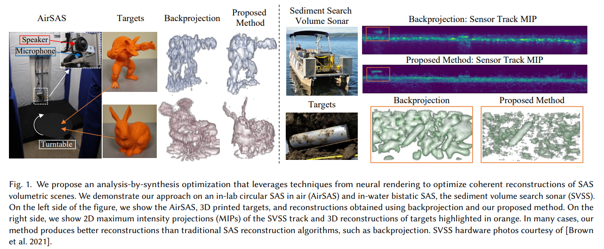
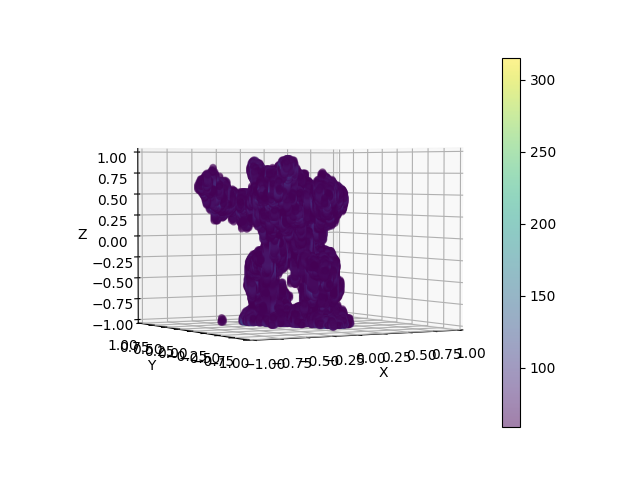
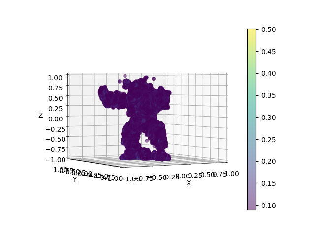
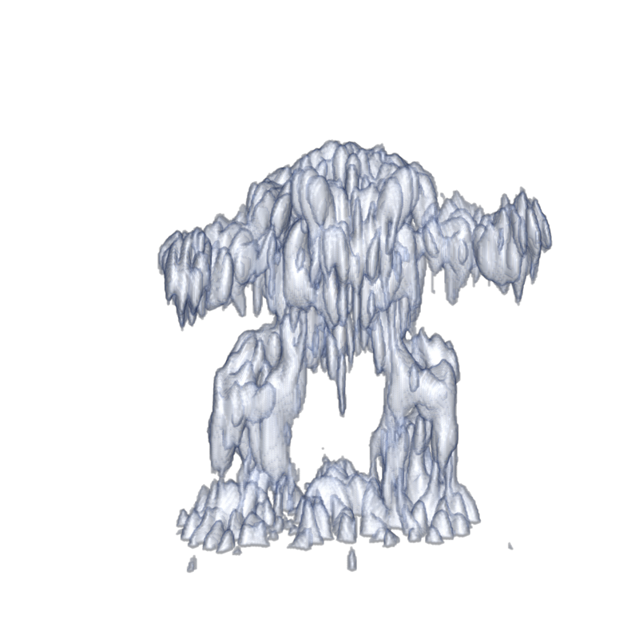
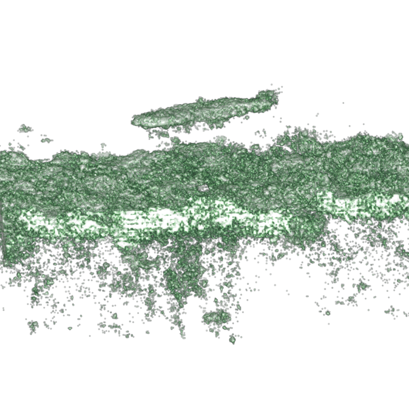

# Neural Volumetric Reconstructions for Coherent Synthetic Aperture Sonar

Codebase for [Neural Volumetric Reconstructions for Coherent Synthetic Aperture Sonar](https://arxiv.org/abs/2306.09909) 
by Albert W. Reed, Juhyeon Kim, Thomas Blanford, Adithya Pediredla, Daniel C. Brown, and Suren Jayasuriya.

<p align="center">
  
</p>


# Installation
## Create the environment

Use the following commands for setting up the code environment. These commands were tested in a Linux 
environment with an A100 GPU.


```
conda create --name nvr_sas -y python=3.8
conda activate nvr_sas
python -m pip install --upgrade pip
```

## Install PyTorch 2.0.1 with CUDA 11.8
Install PyTorch 2.0.1 with CUDA 11.8. 

```
pip install torch==2.0.1+cu118 torchvision==0.15.2+cu118 --extra-index-url https://download.pytorch.org/whl/cu118
```


## Install tiny-cuda-nn Dependencies

Install the [tiny-cuda-nn](https://github.com/NVlabs/tiny-cuda-nn) dependencies used for the neural network. 

```
conda install -c "nvidia/label/cuda-11.8.0" cuda-toolkit
pip install ninja git+https://github.com/NVlabs/tiny-cuda-nn/#subdirectory=bindings/torch
```

## Install the Project

```
git clone https://github.com/awreed/Neural-Volumetric-Reconstruction-for-Coherent-SAS
cd Neural-Volumetric-Reconstruction-for-Coherent-SAS
pip install -e .
```

### (Optional) Tensorboard
You may skip this step if you prefer not to use tensorboard. You can start a 
tensorboard session by running `run_tensorboard.sh`.  You may populate the script with your details: 
`tensorboard --logdir ./ --host <host-number> --port <port-number>`. Note that you may find `<host-number>` using the 
`hostname -I` command on Ubuntu.

# AirSAS Reconstructions

## (Optional) Building and backprojecting AirSAS data from scratch
*GRSI: For the sake of time, please skip this step by downloading the processed data directly in the **Download the data** section.* 

The following steps describe how to process the `.csv` files (e.g., `Flight00000.csv`) that are generated by 
the AirSAS LabView code. The goal is to process the files into a data structure of tensors that we can use
with numpy/pytorch. This data structure is called a `system_data.pik` file, which
is a [pickled](https://docs.python.org/3/library/pickle.html) python [dictionary](https://docs.python.org/3/tutorial/datastructures.html#dictionaries). At a high level, each scene has its own `system_data.pik` file (see **Download the Data** below) 
which contains everything needed for reconstruction: the measurements, scene geometry, and other metadata (e.g., sound speed). 

[Download and unzip the airsas measurements from the bunny and armadillo.](https://drive.google.com/file/d/1mzJx_tesC3XDtUcnjrUvn11N2z8NuXEv/view?usp=sharing)

The unzipped data has the file structure

```
├── airsas_raw_data 
│   ├── arma # AirSAS measurements of the armadillo
│   ├── background # AirSAS measurements of empty scene (used for background subtraction)
│   ├── bunny # AirSAS measurements of the bunny
.   .
.   .
.   .
```

Create `system_data.pik` file for the 20kHz armadillo using `backproject_from_csv.sh` as follows:

```
cd ./scenes/airsas/arma_20k
chmod +x backproject_from_csv.sh
./backproject_from_csv.sh <path/to/airsas_raw_data/arma> <path/to/airsas_raw_data/background> <output_dir>
```

A few things to note:

1. The `backproject_from_csv.sh` script populates the `<output-dir>` with the backprojected scene and create the `system_data.pik` file that is necessary for our method in the next steps.
2. Notice that `backproject_from_csv.sh` contains many commented parameters that can be changed to define the scene dimensions. For example, you could beamform a 2D scene by setting z_max = z_min and num_z = 1:
   - ```
     # Modifying backproject_from_csv.sh to beamform a 2D scene on the z = 0 plane
     
     python ../../../airsas/reconstruct_airsas_scene.py \
        .
        .
        .
        --z_min 0.00 `# Beamforming to the z = 0 plane`
        --z_max 0.00 `# Beamforming to the z = 0 plane`
        .
        .
        .
        --num_z 1 `# There is only "1" z voxel since it is a plane`
      ```
3. The `system_data.pik` can be unpickled to recover a python dictionary. The dictionary structure adheres to the data schema defined in `SASDataSchema` of `data_schemas.py`.
    - ```
      # You can unpickle and explore system_data.pik
      
      import pickle
      import constants as c
      
      # unpickle the system_data.pik file
      with open(system_data.pik, 'rb') as f:
            system_data = pickle.load(f) # system_data is a python dictionary
      
      # For example, access the raw waveforms using
      wfms = system_data[c.WFM_DATA]
      
      # or the soundspeed using
      sound_speed = system_data[c.sound_speed]
      
      print(system_data.keys()) # This will print all the available keys. These are defined and commented in the SASDataSchema class in the file `data_schemas.py`
      ```

We can skip the next step (**Download the data**) since we created the pickle file from scratch. 

## Download the data

[Download the data and unzip the data](https://drive.google.com/file/d/18yMVWS3ZxEgillaqs6aQXBnhgDcRD19c/view?usp=share_link) 
 to obtain: (1) `system_data_bunny_20k.pik`; (2) `system_data_bunny_5k.pik`; (3)`system_data_arma_20k.pik`;
(4) `system_data_arma_5k.pik`. 

Each pickle files contain the data used to generate `Figure 12` in the paper. The pickle files are named according to the scene (i.e., bunny or armadillo) and 
which sonar waveform was used (i.e., 5k or 20k). Each pickle contains a python dictionary which holds the scene 
geometry and measurements necessary for reconstruction. 

## Reconstruct the armadillo using backprojection and our method

We will describe how to reconstruct the armadillo object measured with the 20kHz waveform. Note that `reconstruct.sh`
contains many hyperparameters that can be changed. Currently, they are set to the parameters used in the paper. 

```
cd ./scenes/airsas/arma_20k
chmod +x reconstruct.sh
./reconstruct.sh <path/to/system_data_arma_20k.pik> <pick-an-experiment-name>
```

Successfully running the above will generate a new directory `reconstructed_scenes/` populated with the backprojection result and our result:

```
├── scenes/airsas/arma_20k  
│   ├── reconstructed_scenes  
│        ├── backprojected_scene.mat # backprojected scene (h x w x d complex-valued) 
│        ├── backprojected_scene.npy # npy version of backprojected scene
│        ├── final_upsampled_scene.mat # our reconstructed volumetric scene (h x w x d complex-valued) 
│        ├── final_upsampled_scene.npy # npy version of our reconstructed scene 
.   .
.   .
.   .
```


## Rendering the Results

### Using Python's Matplotlib (not recommended)
If we don't want to use Matlab, we can obtain quick (but poor) visualizations using Matplotlib.

Rendering the backprojection result (from the `./scenes/airsas/arma_20k` directory):
```
 python ../../../inr_reconstruction/matplotlib_render_cmd_line.py --scene_npy_file reconstructed_scenes/backprojected_scene.npy --output_dir ./reconstructed_scenes/ --output_name bp_mpl --thresh 3 --downsample_factor 1 --elev 2 --num_angles 4
```

Render our method's result:
```
python ../../../inr_reconstruction/matplotlib_render_cmd_line.py --scene_npy_file reconstructed_scenes/final_upsampled_scene.npy --output_dir ./reconstructed_scenes/ --output_name ours_mpl --thresh 3 --downsample_factor 2 --elev 2 --num_angles 4
```

The rendered images will be in  `scenes/airsas/arma_20k/reconstructed_scenes`.

(left: backproject, right ours). See the Matlab section below for a better way to render the results. 
<p align="center">
  
   
</p>

### Using Matlab (recommended)

We render the paper results using MATLAB's volshow() function. This requires access to a MATLAB installation that has the `Imaging Processing Toolbox`. Note that these results
could be rendered using any renderer we prefer --- they are simply complex-valued 3D (X x Y x Z) scenes. We take the abs() of the complex
scene before rendering to visualize the scene magnitude. 

To render with matlab, navigate to the project's matlab directory :
```
cd Neural-Volumetric-Reconstruction-for-Coherent-SAS/matlab
```

This directory contains the function:
```
Syntax: volume_render_scene(scene_path, save_path, save_name, threshold, upsample_factor, colormap_option)
Parameters: 
    scene_path: path to the *.mat file containing the scene
    save_path: path to save rendered image
    save_name: name to assign to rendered image
    threshold:  filter scene according to abs(scene) < threshold = 0
    upsample_factor: scaling factor for trilinearly upsampling the scene 
    colormap_option: 0 for red, 1 for blue
    theta_in: rotation
    z: elevatation parameter
```

Render the backprojection result from a matlab terminal using
```
volume_render_scene('../scenes/airsas/arma_20k/reconstructed_scenes/backprojected_scene.mat', '../scenes/airsas/arma_20k/reconstructed_scenes', 'bp', 0.2, 2, 0, 230, 0.5)
```
and our method with
```
volume_render_scene('../scenes/airsas/arma_20k/reconstructed_scenes/final_upsampled_scene.mat', '../scenes/airsas/arma_20k/reconstructed_scenes', 'ours', 0.2, 1, 0, 230, 0.5)
```

<p align="center">
  
   
</p>

The backprojected and our rendered image will be `scenes/airsas/arma_20k/reconstructed_scenes/bp.png` **(shown on left)** and `scenes/airsas/arma_20k/reconstructed_scenes/ours.png` **(shown on right)**, repsectively. These are the results
used in Figure 12 of the main text. 


### Other notes

Note that `reconstruct.sh` simply calls the following commands in order.

1. `backproject.sh` : reconstructs the scene with backprojection (the traditional reconstruction method we compare against)
2. `pulse_deconvolve.sh`: deconvolves the sonar waveforms (step 1/2 of our method)
3. `neural_backproject.sh`: reconstructs the scene using neural backprojection (step 2/2 of our method)
4. `python upsample_network.py`: queries the trained network at arbitrary spatial resolution to obtain a complex 3D scene for rendering

It is helpful for debugging/developing purposes to call these steps one at a time when running new scenes or 
adding new features to the code.

### Reconstructing the other scenes (e.g., the bunny)

The other scenes have identical steps. For example, to reconstruct the bunny, navigate to the `./airsas/bunny_20k` and repeat the above. 
Note that each scene may use different hyperparameters --- the `.sh` scripts for each scene are populated with the hyperparameters used for the paper results.

### Gradient Descent Baseline
In the paper, we compare our method against a 'Gradient Descent' baseline, which is our method without using a neural network
to predict the scene. If you wish to run this baseline, add the `--no_network` flag to `neural_backproject.sh`.

# Sediment Volume Search Sonar (SVSS) Reconstructions

### Download the Data
In accordance with funding agency guidelines: request access to the SVSS dataset by first
contacting `Albert W. Reed at awreed@asu.edu`.


### Example: Reconstructing the Cylindrical Target
Create a `system_data.pik` file for the svss cylinder scene:

```
cd ./scenes/svss/cylinder
chmod +x create_system_data.sh
./create_system_data <path/to/downloaded_data> ./system_data
```

This will output a `system_data.pik` file as well as backprojected imagery to a new directory named `./system_data`.

Deconvolving the waveforms:

```
chmod +x pulse_deconvolve.sh
./pulse_deconvolve ./system_data/system_data.pik ./deconvolved_measurements
```
The first argument is the `system_data.pik` we generated in the previous step, and `./deconvolved_measurements` 
is the output directory.

Reconstruct the scene:

```
chmod +x neural_backproject.sh
./neural_backproject.sh ./system_data/system_data.pik ./deconvolved_measurements ./nbp_output svss_cylinder_exp_1
```

The following command will generate `.mat` file of the final scene in the local directory `./reconstructed_scenes`.

```
python ../../../inr_reconstruction/upsample_network_with_input_args.py \
    --system_data ./system_data/system_data.pik \
    --exp_name svss_cylinder_exp_1 \
    --experiment_dir ./ \
    --inr_config ./nbp_config.json \
    --output_scene_file_name final_scene \
    --output_dir_name reconstructed_scenes \
    --model_path ./nbp_output/svss_cylinder_exp_1/models/004000.tar \
    --sf 2 \
    --flip_z \
    --permute_xy
```

Render the scene with matlab. 

```
volume_render_scene('../scenes/svss/cylinder/reconstructed_scenes/final_scene.mat', '../scenes/svss/cylinder/reconstructed_scenes', 'ours', 0.2, 1, 2, 180, .4)
```

This is a rendering of the cylindrical target hovering above the seafloor. It appears to be hovering since the sonar only
captures returns from the top of the cylinder.
<p align="center">
  
</p>


# Simulated Reconstructions

The folder contains a `system_data.pik` file. Download this file as it will be needed for running the 
simulation data.

The link points to 8 simulated scenes: bunny, xyz_dragon, lucy, dragon, buddha, and aramdillo.
In particular, each folder contains rendered transients from the scene using our ToF renderer. We will
convolve these transients with the sonar waveform to simulate measurements.

Additionally, the folder contains a `gt_meshes` folder used for evaluation. 

We provide an example for reconstructing the buddha object in `scenes/simulated/buddha`. To run this scene:

1) Download the `buddha/data_full.npy` file from the link above.
2) We first will simulate sonar waveforms using the scripts within `scenes/simulated/buddha`. 
In `simulate_waveforms.sh`, point `--input_config` to the path of the `system_data.pik` file downloaded from the 
google drive link. This pickle file contains the scene configuration and is used for all simulated scenes. Additionally, 
point the `--wfm_part_1` argument to the transients file `buddha/data_full.npy`. This script will create a new system_data 
pickle file that will contain the simulated measurements. Define this new file using the `--output_config` argument 
(currently it is set to `system_data_20db.pik`).
3) Use `chmod +x simulated_waveforms.sh` to make the script executable, and then run with `./simulated_waveforms.sh`. 
The simulated measurements will be generated into the new system data pickle file defined by `--output_config`.
4) Next we deconvolve the measurements using the `pulse_deconvolve.sh` script. Pass in the new system data pickle file 
containing the simulated measurements to `--system_data`. Deconvolved measurements will be written to the `--output_dir`.
5) Now we reconstruct the scene from deconvolved measurements using `neural_backproject.sh`. Once again, pass in the new 
system data pickle file containing the simulated measurements to `--system_data`. All other parameters are set to those 
used for the paper result. Results and reconstructions will be sent to `--output_dir`

### Metric Evaluation and Mesh Visualization
We provide code for computing metrics of simulated reconstructions in the `evaluate` folder.
1) First, generate the ground truth point cloud on surface or volume by running `main_generate_gt_point_cloud.sh`.
2) Run `main_mesh_recon_and_3d_space_loss.sh`. This will reconstruct 3d mesh from learned model and also calculate 
following 3d space loss from given point cloud.

Here, the point cloud is generated in two ways, directly from INR voxels (comp_albedo), or from reconstructed 3D mesh. 


- Surface Chamfer Distance : Chamfer distance based on surface point cloud.
- Volume Chamfer Distance : Chamfer distance based on volume point cloud.
- IoU : Intersection over union using between two voxels built from point cloud.


3) Then, run `main_render.sh` to render reconstructed mesh. This will render color, normal and depth image using 
reconstructed mesh, at different camera azimuths.
4) Finally run `main_image_space_loss.sh` to calculate image space loss (lpips, psnr, mse...) on color image or depth image.

Example configurations are provided in `.sh` files, but please make sure to set it corresponding to your environment.

Find an example of the rendered mesh of reconstructed buddha using our method in `./evaluate/example_images/buddha_rendered_images_v1.0.png`.

<p align="center">
  
</p>

We also attach the example of each matric in `example_metrics` folder.
<!-- In the main paper, we use IoU from INR voxels and surface Chamfer distance from reconstructed 3D mesh in the main paper. -->

<!-- Example configurations are provided in `predefined_configs.py`, but some arguments are not given, so please set the correct file inputs depends on your experiment setting. -->
<!-- We also provide example configurations as `.sh` files, so please check it. -->

